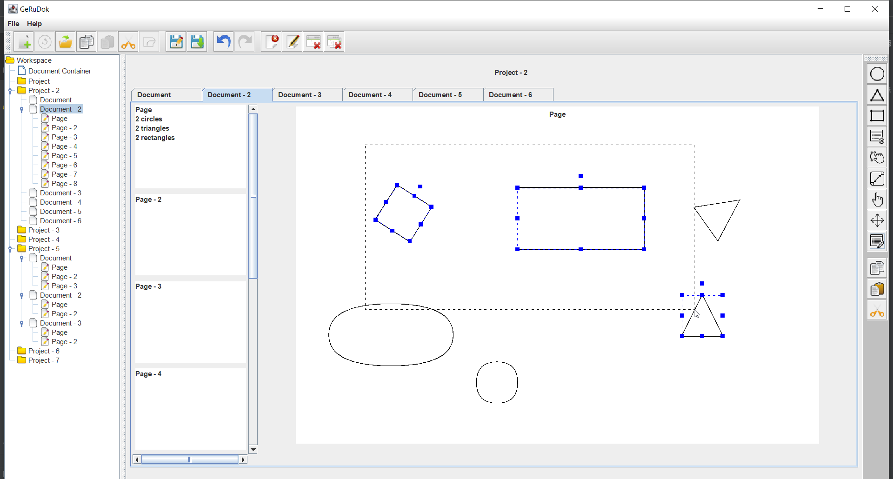

# Generic Document Menager
Generic document menager was a college project from Software Design course in the second year of study created by a team of two students. This project is organized into a workspace where it is possible to create multiple projects, each project contain of multiple documents with pages that can be modified with graphical editor. Projects, documents and pages can be saved, loaded, shared, etc. This project contains many others functionalities. Designe patterns used in this project: MVC, Observer, Singleton, State, Factory Method, Command.

